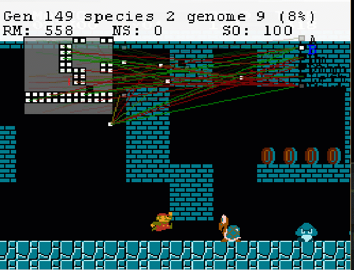
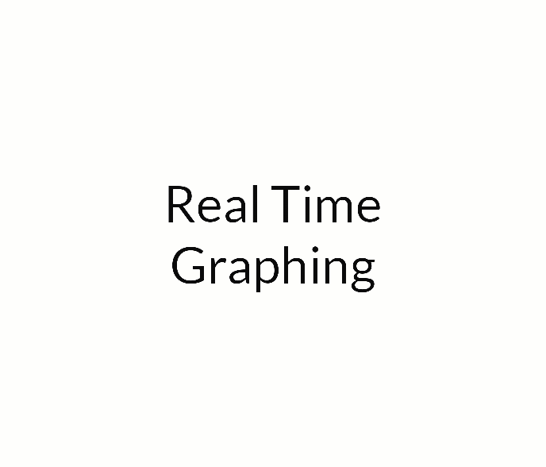

# Meta-MarIO

 
 

## Watch this video to get started with Virtual Evolution:
https://www.youtube.com/watch?v=qv6UVOQ0F44

## FAQ

**Where is the code located?**

It is located at Lua->NES->MarioAI.lua

**How do I adjust the GUI Width and Height?**

Look for 
FitnessBox(140,40,600,700) in code  
Parameter 1 is x spacing between items  
Parameter 2 is y spacing between items  
Parameter 3 is total screen width  
Parameter 4 is total screen height

## Ideas

## Important Bits

Basic Comprendium

http://datacrystal.romhacking.net/wiki/Super_Mario_Bros.:RAM_map

More Detailed Comprendium:

https://gist.github.com/1wErt3r/4048722

| Bit           | Meaning          | 
| ------------- |:-----------------| 
| 075A          |Lives             |
| 0770          |At Menu or in Game|
|07F9-07FB      |Time              | 
|0747,071E      |Freeze Timer      |  
|07A0           |Level Timer       |
|07D8-07DD      |Score             |
|000E           |Dead,alive or can't move        |
|00B5           |Determine if player is in a pit|
## Distruptive Systems

BizHawk Repo:
https://github.com/TASVideos/BizHawk

Frameavance:
https://github.com/TASVideos/BizHawk/blob/master/BizHawk.Emulation.Cores/Consoles/Nintendo/NES/NES.Core.cs

MABE:
https://github.com/wert23239/MHacks216/blob/master/ros_evolve/src/mabe_ros/World/ROSWorld/ROSWorld.cpp

Lua Translator:
http://www.jeremyong.com/blog/2014/01/10/interfacing-lua-with-templates-in-c-plus-plus-11/

## Valley-Crossing (Novelty Search)

Theory:
http://eplex.cs.ucf.edu/noveltysearch/userspage/

Open-Source Code:
https://github.com/jal278/novelty-search-cpp/blob/master/README

## Tweaked SethBling Version

http://pastebin.com/juRnkyEf

## Bizhawk Form Lua 
https://github.com/denilsonsa/bizhawk-lua-scripts

### GUI Goals
http://socialblade.com/youtube/user/pewdiepie/realtime

